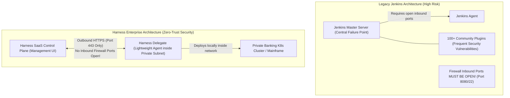

# Module 1: Introduction to Enterprise Software Delivery & Why Harness? (From Jenkins to Harness in Banking)

---

## Curriculum Roadmap Overview
Welcome to your Enterprise Harness DevOps Training Program! Here is our step-by-step master roadmap designed to take you from absolute zero to a Senior Enterprise Harness Architect in banking environments:

* **Module 1**: Introduction to Enterprise Software Delivery & Why Harness? (Jenkins vs Harness in Banking) *(Current Module)*
* **Module 2**: Harness Enterprise Architecture & The Harness Delegate Deep-Dive
* **Module 3**: Harness Secrets Management, RBAC & Enterprise Security (PCI-DSS & SOC2 Compliance)
* **Module 4**: Continuous Integration (CI) Pipelines: Building, Testing, & Vulnerability Scanning
* **Module 5**: Continuous Delivery (CD) Pipelines: Connectors, Environments, & Infrastructure Definitions
* **Module 6**: Production Deployment Strategies: Canary, Blue-Green, & Rolling Deployments
* **Module 7**: Harness Service Reliability Management (SRM) & AI-Driven Verification (Auto-Rollbacks)
* **Module 8**: Enterprise Looping Strategies, Matrix Builds, & Pipeline Chaining
* **Module 9**: Policy as Code (OPA - Open Policy Agent) & Regulatory Compliance Guardrails
* **Module 10**: Cloud Cost Management (CCM) & Enterprise Infrastructure Optimization
* **Module 11**: Real-World Banking Project: Building a Zero-Downtime Payment Gateway Pipeline from Scratch
* **Module 12**: Enterprise Troubleshooting, Production Incidents, & Interview Prep Masterclass

---

# Module 1: Introduction to Enterprise Software Delivery & Why Harness?

---

## 1. Theory

### A. Basic Definitions (What is Software Delivery?)
Before we discuss Harness or Jenkins, let us define what software delivery means in simple terms.

* **Software / Code**: The instructions written by computer programmers. In a bank, code powers the mobile banking app, money transfer service, and credit card fraud checking system.
* **Production Environment (Prod)**: The live computer servers where real bank customers check their bank balances and transfer real money. If Prod goes down, customers cannot pay for groceries or transfer funds, costing the bank millions of dollars per hour.
* **Continuous Integration (CI)**: The automated process of taking new code written by developers, compiling (building) it, and running automated tests to prove the code has no bugs before saving it.
* **Continuous Delivery (CD)**: The automated process of taking tested software and deploying (installing) it safely onto live production servers without stopping the business.

### B. What is Jenkins? (The Legacy Approach)
Created over 15 years ago, **Jenkins** is an open-source tool used to automate building and deploying software. 
* Jenkins uses **Imperative Scripting**: You must write hundreds or thousands of lines of code (Groovy scripts in a `Jenkinsfile`) explaining **HOW** to do every tiny step manually.
* *Analogy*: Jenkins is like building a custom car by hand from raw metal sheets. You must design every single gear, bolt, and wire yourself.

### C. What is Harness? (The Modern Enterprise Approach)
**Harness** is an AI-driven, declarative Continuous Delivery & Integration platform created specifically for complex enterprise environments.
* Harness uses **Declarative Configuration**: Instead of writing long scripts explaining *how* to build or deploy, you simply declare **WHAT** you want (e.g., *"Deploy this Payment Service Docker image to the Production Kubernetes cluster using a Canary strategy"*). Harness handles the execution mechanics automatically.
* *Analogy*: Harness is like buying a modern self-driving luxury car with automatic safety braking, blind-spot radar, and lane assist. You tell it your destination, and it handles the driving mechanics safely.

---

## 2. Architecture Comparison: Jenkins vs Harness



### Key Differences Table

| Feature | Legacy Jenkins | Harness Enterprise |
| :--- | :--- | :--- |
| **Pipeline Creation Model** | Imperative (Write thousands of lines of Groovy code). | Declarative (Visual drag-and-drop or simple YAML). |
| **Network Security** | Requires opening inbound firewall ports into private networks. | Zero open inbound ports! Uses outbound-only HTTPS Delegate architecture. |
| **Maintenance Overhead** | High ("Plugin Hell" - updating one plugin breaks 10 pipelines). | Zero plugin maintenance. Fully managed platform with built-in connectors. |
| **Deployment Intelligence** | No native verification. Requires manual log checking after deployment. | Native Machine Learning (AI verification) that auto-detects errors and rolls back automatically. |
| **Audit & Governance** | Hard to track who changed what across custom Groovy scripts. | Built-in Enterprise RBAC, audit logs, and Open Policy Agent (OPA) compliance out of the box. |

---

## 3. Real-World Banking Use Case

### Customer: Global Financial Institution ("Apex Global Bank")
* **Application**: Core Credit Card Transaction Processing Service.
* **Volume**: 45,000 transactions per second ($1.2 Billion daily volume).

### The Problem with Jenkins:
1. **The Friday Midnight Deployment Nightmare**: Deployments were done manually at midnight on Fridays by a team of 12 engineers running Jenkins Groovy scripts.
2. **Human Error & Downtime**: A developer edited a custom Groovy script in Jenkins, missing an exception check. The script failed midway through a production deployment, leaving 50% of servers on version 1.0 and 50% on version 2.0. The online credit card system crashed for 3 hours on a Saturday morning.
3. **Regulatory Penalty**: Regulatory authorities fined the bank $4.5 Million for unplanned downtime and failure to provide clean audit logs showing who authorized the deployment.

### The Harness Solution:
Apex Global Bank replaced Jenkins with Harness:
* Pipelines were standardized across 400 engineering teams using centralized Harness templates.
* All deployments were converted to **Canary Deployments** (10% traffic first, then 50%, then 100%).
* Harness AI automatically connected to Datadog logs during the deployment. When a minor 0.1% HTTP 500 error spike occurred in the Canary stage, Harness automatically triggered a **zero-downtime rollback in 42 seconds**.
* Complete compliance reports were auto-generated for regulatory auditors.

---

## 4. Hands-on Practical Walkthrough

Let us compare a legacy Jenkins configuration with a modern Harness pipeline definition for a simple banking microservice.

### A. The Old Jenkins Way (Imperative Groovy Script snippet):
```groovy
// Jenkinsfile - Fragile, hard to maintain, requires custom error handling
pipeline {
    agent any
    stages {
        stage('Build') {
            steps {
                sh 'mvn clean package'
            }
        }
        stage('Deploy to Prod') {
            steps {
                // Manually scripting SSH connections and kubectl commands
                sh '''
                    scp target/payment-service.jar admin@10.0.4.12:/app/
                    ssh admin@10.0.4.12 "systemctl restart payment-service"
                    // IF THIS CRASHES, THERE IS NO AUTO ROLLBACK!
                '''
            }
        }
    }
}
```

### B. The Modern Harness Way (Declarative YAML):
```yaml
# Harness Pipeline Definition - Standardized, safe, declarative
pipeline:
  name: Payment Service Pipeline
  identifier: Payment_Service_Pipeline
  projectIdentifier: Retail_Banking
  orgIdentifier: Core_Banking_Org
  stages:
    - stage:
        name: Build and Test
        identifier: Build_and_Test
        type: CI
        spec:
          execution:
            steps:
              - step:
                  type: Run
                  name: Maven Package
                  spec:
                    command: mvn clean package
    - stage:
        name: Deploy to Production
        identifier: Deploy_to_Production
        type: Deployment
        spec:
          deploymentType: Kubernetes
          service:
            serviceRef: payment_microservice
          environment:
            environmentRef: production_bank_cluster
          execution:
            steps:
              - step:
                  type: K8sCanaryDeploy
                  name: Canary 10 Percent
                  spec:
                    instances: 10%
              - step:
                  type: HarnessAutoVerification
                  name: AI Health Check
              - step:
                  type: K8sCanaryPromote
                  name: Promote to 100 Percent
```

---

## 5. Production Scenario

### Scenario: The Emergency Hotfix during Peak Trading Hours
* **Time**: 2:15 PM on a Tuesday (Peak Stock Trading Hours).
* **Incident**: A critical bug is found in the currency exchange rate conversion logic. Customers are getting incorrect stock quotes.
* **Goal**: Push a hotfix code patch to production immediately with **ZERO risk** of breaking the trading platform.

### How this is executed in an Enterprise Harness Environment:
1. **Developer pushes fix**: Developer pushes the fix to the `hotfix/currency-fix` branch in GitHub.
2. **Automated CI Stage Triggered**: Harness CI automatically spins up an isolated ephemeral pod, runs unit tests, scans for OWASP vulnerabilities using Snyk, and builds a signed Docker container image.
3. **OPA Policy Gate**: Harness automatically evaluates Open Policy Agent policies. It checks: *"Is this hotfix signed by a Security Lead? Yes."*
4. **Canary Deployment**: Harness Delegate deploys the hotfix to **only 1 instance out of 50** in the live cluster.
5. **AI Real-Time Verification**: Harness monitors real-time transaction logs. Within 2 minutes, Harness confirms 0 calculation errors on the new pod and automatically promotes the fix to all 50 instances.

---

## 6. Troubleshooting Enterprise Migrations

When migrating from Jenkins to Harness in a bank, enterprise engineers face these common challenges:

| Problem / Failure | Root Cause | Enterprise Resolution |
| :--- | :--- | :--- |
| **Delegate Connection Offline** | Network team blocked outbound firewall access from private subnet to Harness SaaS. | Ensure outbound HTTPS (Port 443) to `app.harness.io` is whitelisted. No inbound ports required. |
| **Jenkins Script Dependency Failure** | Custom bash/python scripts written for Jenkins contain hardcoded local file paths (`/var/lib/jenkins/...`). | Containerize build steps into Docker images so dependencies are completely portable in Harness CI. |
| **Permission Denied during Deployment** | The Service Account attached to the Harness Delegate lacks Kubernetes RBAC permissions. | Grant appropriate ClusterRole / RoleBindings to the Harness Delegate's Kubernetes Service Account. |

---

## 7. Best Practices for Banking DevOps

1. **Never use Imperative Scripts for Deployments**: Always use declarative Harness deployment templates (Canary / Blue-Green) rather than custom shell scripts.
2. **Enforce Least-Privilege Access**: Assign granular Role-Based Access Control (RBAC) in Harness so developers can trigger builds, but only Release Managers can approve Production releases.
3. **Decouple Build from Deploy**: Separate Continuous Integration (building artifacts) from Continuous Delivery (deploying artifacts).
4. **Mandate Immutable Artifacts**: Build Docker images with unique commit hashes (`payment-service:v1.4.2-a8f9c2`) rather than mutable tags like `latest`.

---

## 8. Interview Questions & Answers

### Q1: Why would a Fortune 500 bank migrate from Jenkins to Harness?
**Answer**: 
> "Legacy Jenkins relies on imperative Groovy scripting, complex plugin management, and requires opening inbound firewall ports, creating high operational overhead and security risks. Harness provides a declarative, zero-trust architecture using lightweight local Delegates with outbound-only communication. Furthermore, Harness offers native AI-driven verification for automated zero-downtime rollbacks, enterprise RBAC, and policy enforcement (OPA), which drastically reduces deployment failures and compliance audit costs."

### Q2: What is the fundamental architectural difference between Jenkins Master-Agent and Harness Manager-Delegate?
**Answer**: 
> "In Jenkins, the Master controls agents over open inbound network connections (like SSH or TCP 8080), exposing internal infrastructure to potential attack. In Harness, the Control Plane (Manager SaaS) is completely separated from the Execution Plane (Delegate). The Delegate runs inside the customer's private network and establishes an outbound-only HTTPS connection (Port 443) to poll tasks. Secrets and target credentials never leave the bank's internal network."

### Q3: What is the difference between Imperative and Declarative CI/CD pipelines?
**Answer**: 
> "Imperative CI/CD (like Jenkins Groovy scripts) requires the engineer to explicitly code every single step, error handler, and rollback mechanism manually. Declarative CI/CD (like Harness YAML) allows the engineer to define the desired end state (e.g., 'Deploy Service X to Environment Y using Blue-Green strategy'), while the platform handles the underlying steps, state tracking, and rollback mechanisms automatically."

---

## 9. Assignment for Module 1

### Scenario Task:
You are hired as the Lead DevOps Architect at **First National Merchant Bank**. The VP of Infrastructure asks you to present a proposal to replace their 10-year-old Jenkins server with Harness.

**Your Task**:
Answer the following 3 questions in detail:
1. Identify 3 major security risks of their current Jenkins setup where open inbound firewall ports and static secret keys are stored on the Jenkins Master.
2. Explain how the Harness Delegate architecture solves these 3 security risks.
3. Outline a 4-stage pipeline workflow (CI, Scan, Staging CD, Prod CD) for their core ATM Transaction API service.

*(Write down your answers or reflect on them before proceeding to Module 2!)*

---

## 10. Summary

* **CI/CD** is the backbone of modern banking software delivery.
* **Jenkins** requires manual Groovy scripting, heavy plugin maintenance, and open inbound network ports.
* **Harness** is a modern declarative platform utilizing an outbound-only **Delegate architecture** and **AI verification**.
* In banking, Harness reduces deployment downtime from hours to seconds and enforces strict security and compliance out of the box.

---
*Ready to proceed to **Module 2: Harness Enterprise Architecture & The Harness Delegate Deep-Dive**!*
