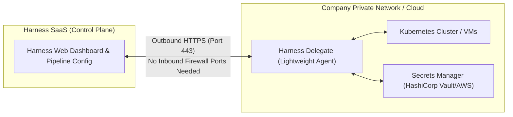
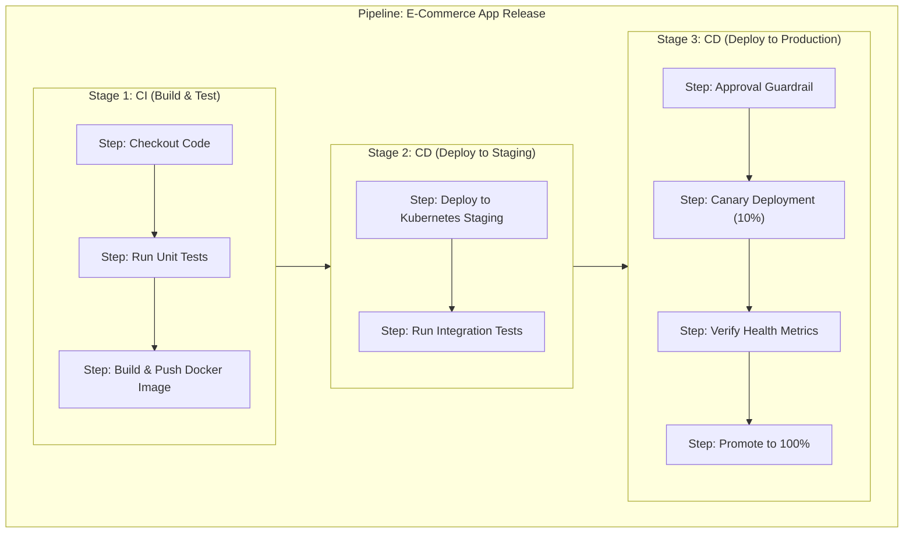

# Beginner's Guide to Harness & CI/CD Pipelines

## 1. What is Harness? (The Real-World Analogy)

Imagine you own a **popular pizza chain**. 
* **The Code**: The recipe created by your chefs (developers).
* **The App**: The hot, delicious pizza served to customers (users).
* **Continuous Integration & Delivery (CI/CD)**: The automated kitchen and delivery system that turns raw recipes into delivered pizzas.

Without automation, every single pizza requires a chef to manually check ingredients, hand-bake, inspect quality, package, and drive to the customer's house. If a driver takes a wrong turn or the oven is set to the wrong temperature, customers get cold or burnt pizza.

**Harness** is like the **Ultimate Smart Factory & Autonomous Delivery Fleet**.
Whenever a chef updates a recipe (writes new code), Harness:
1. Automatically verifies the ingredients (runs unit tests).
2. Bakes a sample pizza in a test oven (builds container images).
3. Checks if the pizza meets safety standards (runs security scans).
4. Delivers the pizza first to 5% of VIP customers (Canary deployment).
5. Monitors customer feedback automatically; if any customer leaves a bad review or gets sick, Harness **instantly rolls back** the delivery and restores the old recipe automatically!

---

## 2. Why Companies Use Harness

Before platforms like Harness, software engineering teams spent hundreds of hours writing complex custom bash scripts or maintaining fragile Jenkins pipelines.

Key reasons companies choose Harness:

| Feature | Why Companies Love It |
| :--- | :--- |
| **Artificial Intelligence & Automated Rollbacks** | Harness uses machine learning to monitor logs and metrics (Datadog, Prometheus) during deployments. If error rates spike, it automatically rolls back without human intervention. |
| **Developer Self-Service** | Provides a visual pipeline builder and template library so developers can build pipelines in minutes without being DevOps experts. |
| **Enterprise Governance & Security** | Enforces policies (using Open Policy Agent - OPA) across the whole company (e.g., "No deployment to production without security scans"). |
| **Cloud Cost Management (CCM)** | Automatically identifies wasted cloud resources (idle Kubernetes clusters, unused AWS VMs) and cuts costs. |
| **Delegate-Based Security Architecture** | Keeps company secrets and cloud credentials safely inside your private network without exposing them to SaaS servers. |

---

## 3. Harness Architecture & Installation ("The Delegate")

Harness operates on a **Split Control & Execution Plane** architecture:



### Installation Step-by-Step (Setting up the Harness Delegate)

1. **Sign up for Harness SaaS**: You control everything from the web UI (`app.harness.io`).
2. **Download/Install the Harness Delegate**: 
   - The **Delegate** is a lightweight worker process (running in a Docker container or Kubernetes pod) inside your own infrastructure.
   - You install it with a simple command:
     ```bash
     kubectl apply -f harness-delegate.yaml
     ```
3. **Outbound-Only Connection**: 
   - The Delegate reaches *out* to Harness SaaS over HTTPS (Port 443).
   - **Why this matters**: You never have to open inbound firewall ports or expose your private Kubernetes cluster to the public internet!
4. **Secrets & Execution stay local**: 
   - Your database passwords and deployment targets stay in your local network. The SaaS UI only sends instructions (e.g., *"Deploy version 2.0 to Cluster A"*), and the Delegate executes them locally.

---

## 4. Pipeline Building Blocks: Steps, Stages, Jobs & Pipelines

To understand Harness, think of it as a Russian nesting doll:

$$\text{Pipeline} \longrightarrow \text{Stages} \longrightarrow \text{Jobs / Step Groups} \longrightarrow \text{Steps}$$



### Key Definitions:
* **Step**: The smallest single action (e.g., run a shell command, execute `docker build`, or send a Slack message).
* **Job / Step Group**: A containerized environment or pod where a group of sequential or parallel steps execute together.
* **Stage**: A major phase of the software lifecycle (e.g., *Build Stage*, *Security Audit Stage*, *Dev Deployment Stage*, *Production Deployment Stage*).
* **Pipeline**: The entire end-to-end workflow connecting all stages together.

---

## 5. End-to-End CI/CD Workflow Step-by-Step

Here is what happens every time a developer updates code:

```
[Developer pushes code to GitHub] 
       │
       ▼
 1. TRIGGER ─────────── GitHub webhook notifies Harness
       │
       ▼
 2. BUILD (CI) ──────── Delegate pulls code, builds binary/Docker image
       │
       ▼
 3. TEST (CI) ───────── Runs unit tests & static analysis (SonarQube)
       │
       ▼
 4. SCAN (CI) ───────── Checks Docker image for security vulnerabilities (Trivy/Snyk)
       │
       ▼
 5. ARTIFACT REGISTRY ─ Pushes clean Docker image to DockerHub or AWS ECR
       │
       ▼
 6. STAGING (CD) ────── Deploys to Staging environment for automated integration tests
       │
       ▼
 7. APPROVAL ────────── Sends Slack notification for team lead to approve Prod release
       │
       ▼
 8. PRODUCTION (CD) ── Performs Blue-Green or Canary deployment to live users
       │
       ▼
 9. VERIFICATION ────── AI checks logs & APM (Datadog/Dynatrace). Auto-rolls back if errors detected!
```

---

## 6. Looping Strategies in Harness

When you need to execute tasks multiple times with variations (e.g., testing on 3 different Node.js versions or deploying to 10 Kubernetes clusters across different regions), Harness provides built-in **Execution & Looping Strategies**.

Instead of copy-pasting code 10 times, you define **one step or stage** and apply a looping strategy.

### 1. Matrix Strategy (Multi-Dimensional Parallel Loop)
Use a **Matrix** when you want to run tasks across combinations of variables simultaneously.

**Scenario**: Testing your app across 2 Operating Systems and 2 Node.js versions.

```yaml
# Matrix Loop Definition
matrix:
  os: [ubuntu, alpine]
  nodeVersion: [18, 20]
```

This automatically creates **4 parallel jobs**:
1. `ubuntu` + `Node 18`
2. `ubuntu` + `Node 20`
3. `alpine` + `Node 18`
4. `alpine` + `Node 20`

---

### 2. Repeat / Multi-Instance Strategy (List/Range Loop)
Use **Repeat** when you want to iterate over a list of items or array variables.

#### A. Repeat over a List (Parallel or Sequential)
**Scenario**: Deploying microservice updates to 3 Kubernetes clusters sequentially or in parallel.

```yaml
# Repeat Loop Definition
repeat:
  items:
    - us-east-cluster
    - us-west-cluster
    - eu-central-cluster
  maxConcurrency: 1 # Sequential execution (one by one)
```

#### B. Repeat with Count / Range
**Scenario**: Running 5 performance stress-test instances at once.

```yaml
repeat:
  count: 5
  maxConcurrency: 5 # Runs all 5 concurrently
```

---

### Comparison of Looping Strategies

| Strategy | Primary Use Case | Example |
| :--- | :--- | :--- |
| **Matrix Strategy** | Combinatorial testing across multiple environments or versions. | Run matrix of `[Java 11, Java 17]` $\times$ `[PostgreSQL, MySQL]`. |
| **Repeat (List)** | Processing a dynamic list of environments, regions, or services. | Loop through target regions: `[us-east-1, eu-west-1, ap-southeast-1]`. |
| **Repeat (Count)** | Repeating a step a specific number of times. | Run stress-testing jobs 10 times in parallel. |

---

## Summary Checklist for Beginners

1. **Harness** automates code building, testing, security, and deployment safely.
2. **The Delegate** is the local agent installed in your cluster that executes jobs securely without opening inbound ports.
3. **Steps** combine into **Jobs**, which form **Stages**, which link into **Pipelines**.
4. **CI** turns code into tested, scanned Docker images; **CD** takes those images and deploys them to live servers.
5. **Matrix & Repeat strategies** let you run parallel tests and multi-region deployments cleanly without duplicating pipeline code.
